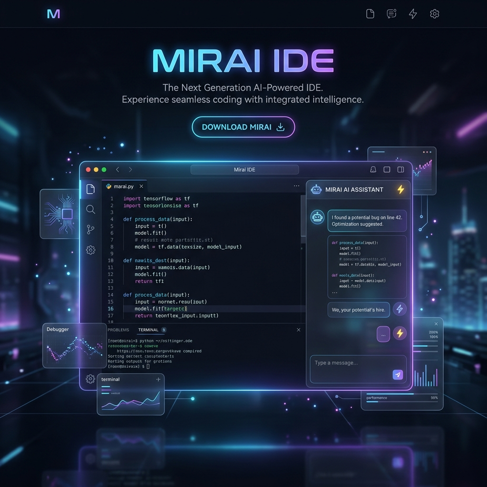
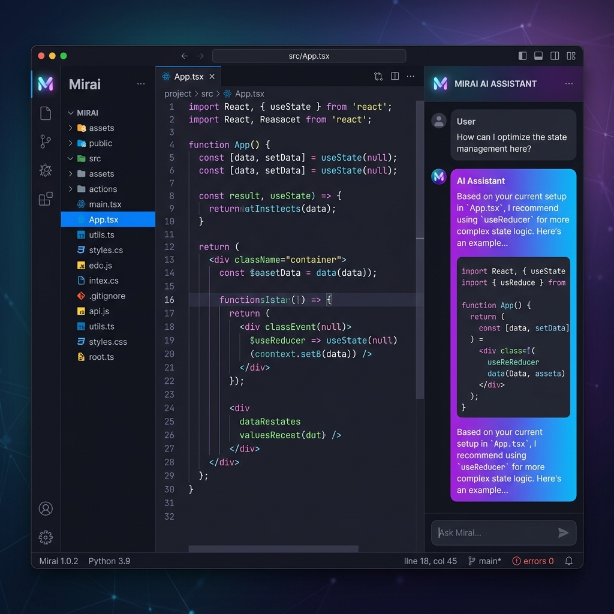

<div align="center">



# 🌌 Mirai IDE
**An AI-powered IDE that combines a modern, responsive web interface with a robust local backend.**

[](https://reactjs.org/)
[](https://nextjs.org/)
[](https://www.python.org/)
[](https://flask.palletsprojects.com/)
[](https://www.electronjs.org/)
</div>

<br />



## ✨ Features
- 📂 **Full local filesystem workspace explorer**
- 🪟 **Floating panels with drag-and-drop support**
- 🤖 **Fully integrated AI Chat and autonomous Agent**
- 💻 **Local command-line terminal emulation**
- 🌿 **Git version control interface**

---

## 🏗️ Architecture & Tech Stack

Mirai is built using a modern architecture:
- 🎨 **Frontend**: Next.js (React), Tailwind CSS, Lucide Icons.
- ⚙️ **Backend**: Python Flask, providing local filesystem access, git integration, terminal PTY support, and AI agent endpoints.
- 🖥️ **Desktop Environment**: Electron, bridging the frontend and backend into a seamless desktop application.

> **Recent Changes:**
> The backend has been completely migrated from `FastAPI` to a more straightforward, synchronous **Flask** architecture using standard threading and `flask-sock` for WebSocket support. This ensures better compatibility for synchronous AI and filesystem tasks while remaining performant for local use.

---

## 🚀 Getting Started

### 📋 Prerequisites
- Node.js (v18+)
- Python 3.10+
- `pip` package manager

### 🛠️ Installation

1. **Install Frontend and Electron Dependencies:**
   ```bash
   npm install
   ```

2. **Set up the Python Backend:**
   Navigate to the backend directory and install requirements globally (or use your preferred environment manager):
   ```bash
   cd backend/python
   pip install -r requirements.txt
   ```

---

## 🎮 Running the App

Mirai can be run as a Desktop app (via Electron) or purely in the browser!

### Option 1: Browser Version (Recommended for quick start)
You can run Mirai directly in your browser **without needing to install or run the Electron app!**

Just double-click the `start-web.bat` file, or run from terminal:
```bash
# Windows
.\start-web.bat
```
This will automatically:
1. Start the Flask backend server.
2. Start the Next.js frontend dev server.
3. Open `http://localhost:4000` in your default web browser.

### Option 2: Full Desktop Application
If you want the complete desktop experience with system-level integrations:

```bash
# From the root of the project
npm run dev
```

The script will automatically start:
1. The Flask backend server on `127.0.0.1:8000`.
2. The Next.js frontend dev server (used by Electron).
3. The Electron window wrapper.

---

## 📁 Project Structure
- `/frontend`: Contains the Next.js UI, React components (e.g., `HyprEditor`, `HyprTerminal`), and global state (`ideStore.ts`).
- `/backend/python`: Contains the Flask server (`main.py`), REST routers (`routers/`), and WebSocket services (`services/`).
- `/electron`: Contains the Electron main process script (`main.js`).
